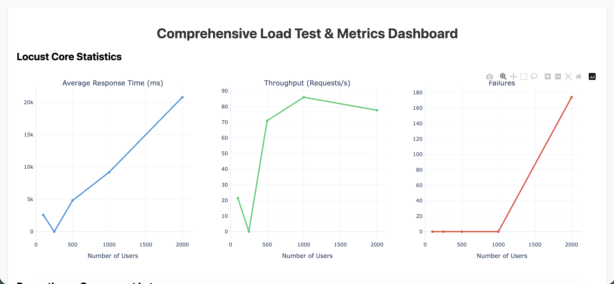
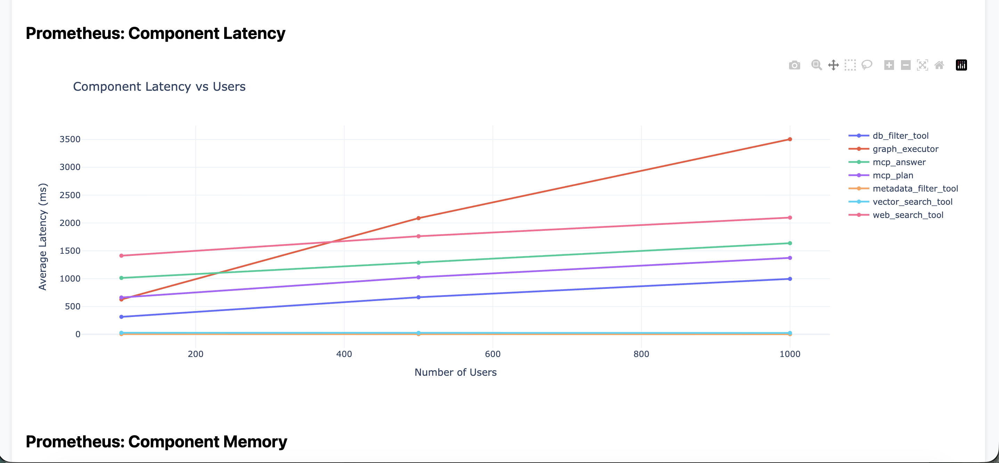
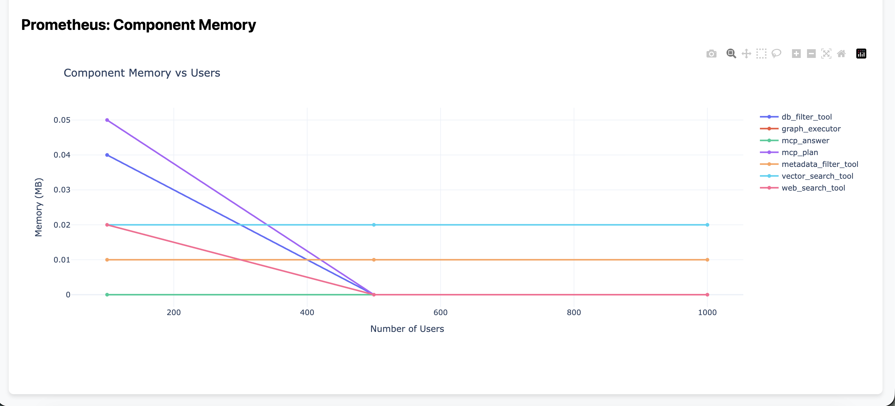

---

# Architecture Scaling Proposal: Decoupling the Graph Executor

## 1. Executive Summary

Performance evaluation of the Orion orchestration framework identified a scalability limitation under high-concurrency workloads. Experimental results demonstrate stable, near-linear scaling up to **1,000 concurrent users**. Beyond this workload, the system exhibits significant degradation in throughput, response latency, and request reliability. Analysis indicates that the primary source of this limitation is the `graph_executor`, which coordinates execution of retrieval plans throughout the orchestration pipeline. To improve scalability, this report proposes extracting the `graph_executor` into an independently deployable microservice capable of horizontal scaling.

---

## 2. Scalability Analysis

Load-testing experiments indicate that the orchestration framework maintains stable performance up to **1,000 concurrent users**. Under this workload, the system sustains approximately **85–90 requests per second** while maintaining a **0% request failure rate**.

Increasing the workload from **1,000** to **2,000 concurrent users** results in a substantial decline in system performance characterized by:

* Reduced sustained throughput.
* Significant increases in end-to-end response latency, reaching approximately **20 seconds**.
* Increased request failures caused by upstream gateway timeouts and connection exhaustion.

These observations indicate that the current architecture reaches a practical concurrency limit near 1,000 simultaneous users.

```markdown

```

**Figure 1.** Core system performance metrics illustrating the reduction in throughput, increased response latency, and higher request failure rate when the workload exceeds 1,000 concurrent users.

---

## 3. Component-Level Bottleneck Analysis

Prometheus telemetry was analyzed to identify the source of the observed performance degradation.

The latency profiles of the retrieval components—including the `vector_search_tool`, `metadata_filter_tool`, and `db_filter_tool`—remain nearly constant across all evaluated workload levels, indicating that these components are not responsible for the observed scalability limitations.

In contrast, the `graph_executor` exhibits substantial latency growth as concurrency increases.

```markdown

```

**Figure 2.** Average execution latency of major orchestration components during load testing.

The average execution latency of the `graph_executor` increases to approximately **3.5 seconds** at **1,000 concurrent users**, exceeding the latency of all other orchestration components. Because every retrieval plan is coordinated through the graph execution engine, increased execution latency delays downstream task scheduling and response aggregation. Consequently, requests remain active for longer periods, increasing contention for shared execution resources and contributing to the elevated end-to-end response times observed during high-concurrency workloads.

These measurements identify the `graph_executor` as the primary computational bottleneck within the orchestration pipeline.

---

## 4. Memory Utilization Analysis

To determine whether the observed degradation was caused by memory exhaustion, memory utilization was evaluated for all major system components throughout the load-testing experiments.

```markdown

```

**Figure 3.** Memory utilization (MB) of major orchestration components as concurrent workload increases.

The collected telemetry demonstrates that memory consumption remains stable throughout all workload configurations, including experiments with **2,000 concurrent users**. No component exhibits abnormal memory growth, sustained allocation increases, or evidence of resource exhaustion that would indicate a memory leak or out-of-memory condition.

These observations indicate that memory utilization is not the limiting factor affecting scalability. Instead, the performance degradation is consistent with a compute-bound synchronization bottleneck within the graph execution layer, where increasing concurrency results in higher execution latency and contention for shared computational resources.

---

## 5. Proposed Architecture

To improve scalability beyond the current concurrency limit, the following architectural modifications are proposed.

### 5.1 Graph Executor Service Decomposition

The `graph_executor` should be extracted from the primary orchestration service and deployed as an independent microservice. Separating graph execution from the API orchestration layer allows execution resources to be provisioned independently of the remaining system components.

### 5.2 Independent Horizontal Scaling

The dedicated `graph_executor` service should be deployed using Kubernetes with a Horizontal Pod Autoscaler (HPA). Independent scaling enables computational resources to be allocated specifically to the graph execution workload while avoiding unnecessary replication of comparatively lightweight retrieval services such as the `vector_search_tool`, `db_filter_tool`, and `metadata_filter_tool`.

### 5.3 Service Boundary and Communication Model

Communication between the orchestration service and the graph execution service should be redesigned to use either an asynchronous messaging interface or an efficient gRPC-based communication layer. Separating graph execution from the request-handling path reduces contention within the orchestration service while enabling the execution engine to scale independently under increasing computational demand.

```markdown

```

**Figure 4.** Proposed architecture illustrating the extraction of the `graph_executor` into an independently scalable microservice with dedicated horizontal scaling capabilities.

---

## 6. Expected Outcomes

The proposed architecture isolates the primary computational bottleneck from the remainder of the orchestration framework, enabling independent resource allocation and horizontal scaling of the graph execution engine. This architectural modification is expected to reduce execution contention under high-concurrency workloads, improve sustained throughput, decrease end-to-end response latency, and extend the system's practical scalability beyond the current limit of approximately **1,000 concurrent users** while preserving the modular design of the existing orchestration framework.
