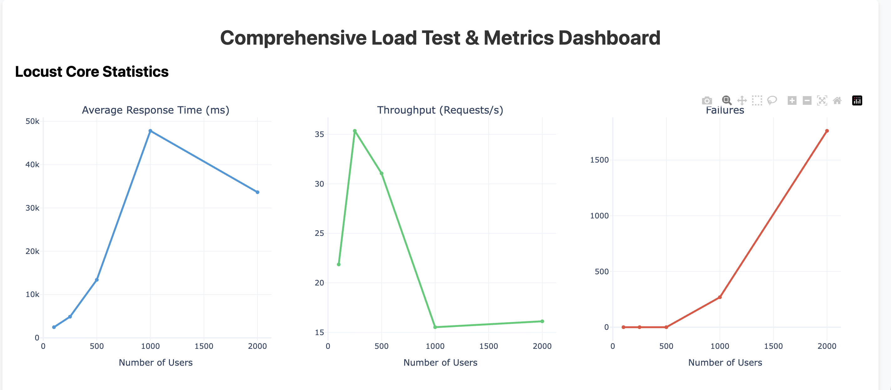
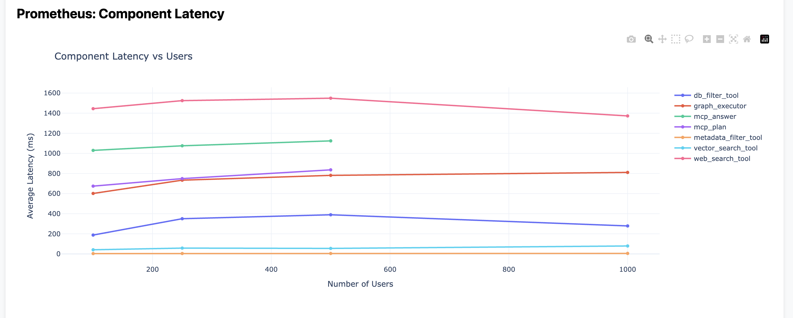
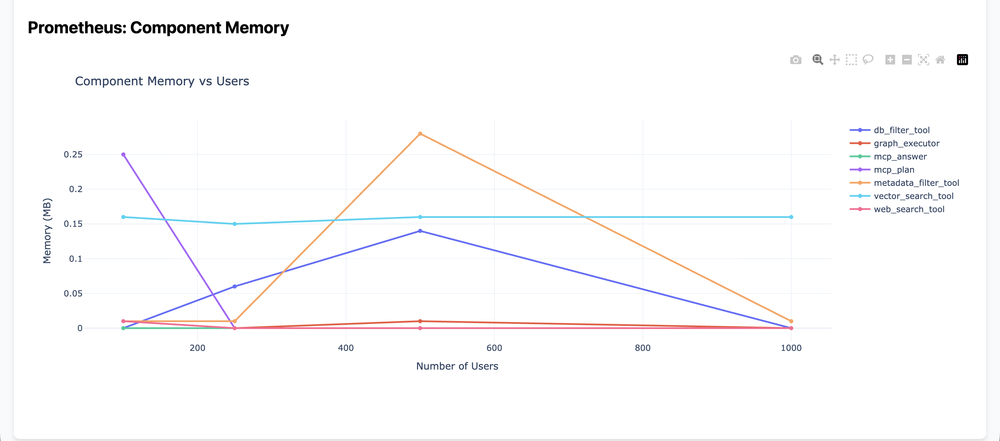

# Architectural Benchmark Report: Monolithic and Microservice Architectures on Local Infrastructure

This report presents a comparative performance evaluation of two deployments of the Orion retrieval framework under high-concurrency workloads of up to **2,000 concurrent users**. The study compares a **monolithic architecture**, in which all components execute within a single application process, against a **containerized microservice architecture** deployed on a local Kubernetes environment. The objective is to characterize the performance tradeoffs associated with each architectural approach under identical workloads.

---

# 1. System Throughput and End-to-End Performance

```markdown



```

**Figure 1.** Locust performance metrics comparing throughput, average response time, and request failures for the microservice and monolithic deployments.

This experiment evaluates overall system performance as observed by external clients.

## Analysis

The monolithic deployment maintained stable throughput throughout the evaluated workload range, sustaining approximately **80 requests per second** while exhibiting no request failures up to approximately **1,000 concurrent users**.

In contrast, the microservice deployment experienced a substantial reduction in throughput as concurrency increased. Beyond approximately **1,000 concurrent users**, throughput declined from approximately **35 requests per second** to **15 requests per second**, while average response latency increased to nearly **50 seconds**. During the same workload, the system experienced more than **1,500 failed requests**.

Because the experiments were performed on a single local machine, all inter-service communication traversed the local virtual networking stack. Under high request rates, this environment introduced significant communication overhead and increased contention for network resources, resulting in gateway queueing and connection failures.

By comparison, the monolithic deployment performs function calls entirely through shared process memory, eliminating the networking overhead associated with inter-service communication.

---

# 2. Component Execution Latency

```markdown



```

**Figure 2.** Component-level execution latency measured using Prometheus.

This experiment evaluates the execution latency of individual orchestration components independently from overall client response time.

## Analysis

Within the microservice deployment, execution latency for individual services—including the `vector_search_tool`, `metadata_filter_tool`, and related retrieval components—remained relatively constant across increasing workload levels. These measurements indicate that component execution time remained stable despite increasing external demand.

However, overall client response latency increased substantially because requests accumulated within upstream networking and gateway layers before reaching the execution services.

In the monolithic deployment, component execution latency increased gradually as concurrency increased. Since all orchestration components execute within a single Python process, increasing workload results in greater contention for shared CPU resources, producing longer execution times for individual operations.

These observations illustrate two distinct sources of performance degradation. In the microservice deployment, latency is dominated by communication and request queueing, whereas in the monolithic deployment, latency is primarily associated with competition for computational resources within a shared execution environment.

---

# 3. Memory Utilization

```markdown



```

**Figure 3.** Memory utilization of orchestration components during increasing concurrent workloads.

This experiment evaluates component memory utilization throughout the load-testing process.

## Analysis

The microservice deployment exhibits increased memory utilization as concurrency increases. Several components, including the `mcp_plan` and `metadata_filter_tool`, demonstrate noticeable increases in allocated memory beginning near the **500 concurrent user** workload.

This behavior is consistent with the buffering of incoming requests, serialization and deserialization of network payloads, and temporary allocation of protocol-specific communication structures required for inter-service communication.

The monolithic deployment maintains comparatively stable memory utilization throughout the evaluated workload range. Because all components execute within a single process, data structures are exchanged through direct memory references rather than serialized network messages, reducing temporary object creation and communication overhead.

These results demonstrate that separating application components into independent services introduces additional memory overhead associated with message serialization, transport buffering, and protocol processing.

---

# 4. Comparative Discussion

The experimental results demonstrate that the two architectures exhibit fundamentally different performance characteristics under a localized deployment.

The monolithic implementation benefits from direct in-process communication, eliminating network serialization, socket management, and protocol overhead. Consequently, it achieves higher throughput, lower end-to-end latency, and reduced memory consumption when executed on a single machine.

The microservice implementation, while introducing additional communication overhead, isolates application components into independently deployable services. This separation preserves relatively stable execution latency within individual services, even when overall request latency increases due to congestion within the networking layer.

These findings indicate that the observed limitations of the microservice deployment arise primarily from the constraints of the local virtual networking environment rather than the computational performance of the individual services themselves.

---

# 5. Conclusion

Under the experimental conditions evaluated in this study, the **monolithic architecture** provides superior performance with respect to throughput, response latency, request reliability, and memory utilization. These improvements are attributable to the elimination of inter-service communication overhead and the use of direct in-process memory access.

The **microservice architecture**, however, offers architectural properties that extend beyond the scope of a single-machine deployment. Because services are independently deployable and horizontally scalable, communication and request-processing workloads can be distributed across multiple physical nodes within a cloud environment. As a result, the networking bottlenecks observed in the local deployment can be mitigated through distributed infrastructure, allowing the architecture to scale beyond the practical limits of a monolithic application while preserving service isolation and operational flexibility.
