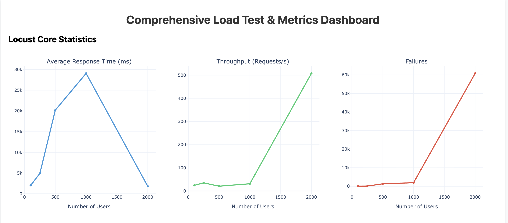
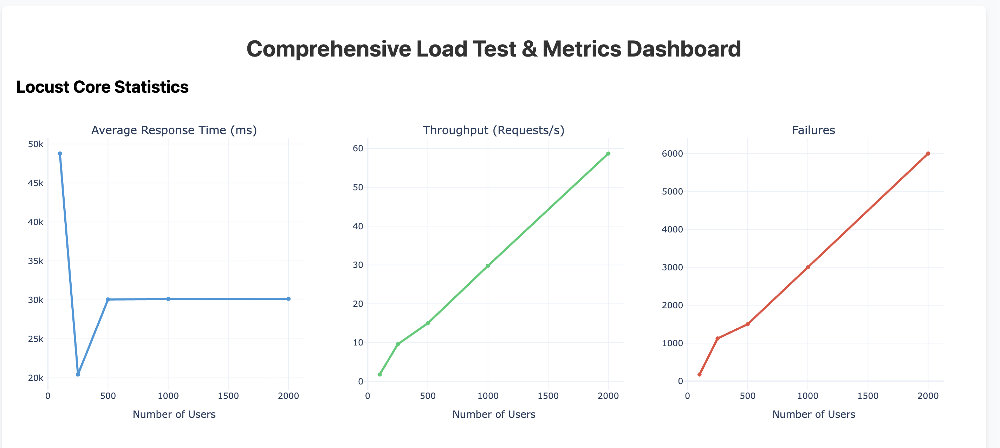

---

# Load Test Analysis: Synchronous vs. Asynchronous Microservice Execution

## Objective

This analysis evaluates the impact of introducing an asynchronous message queue between microservices. The only architectural change between the two experiments is the addition of a Redis-based task queue between the API Gateway and Executor services.

The objective is to determine how queue-based workload buffering affects system stability under high concurrent user load.

---

# 1. Synchronous Microservice Architecture

In the synchronous architecture, the API Gateway directly forwards incoming requests to the Executor service through synchronous communication.

### Observed Behavior

During high concurrency tests, incoming traffic exceeded the processing capacity of the Executor and downstream services.

Key effects:

* The Gateway maintained a large number of active connections.
* Executor resources became saturated by concurrent requests.
* Memory and thread usage increased rapidly.
* The system entered a failure state where requests were rejected rather than processed.

The observed increase in throughput during failure conditions does not represent improved performance. Instead, it represents rapid request rejection after system resources were exhausted.

---

# 2. Asynchronous Queue-Based Microservice Architecture

The asynchronous architecture introduces Redis as an intermediate message broker between the API Gateway and Executor.

### Observed Behavior

The queue successfully separated request ingestion from request execution.

Key effects:

* Incoming requests were accepted and stored in Redis.
* Executor workload was limited to available processing capacity.
* The system remained operational under high load.
* Failures occurred primarily due to request expiration rather than service crashes.

The stable failure pattern indicates controlled degradation. The system continued operating while processing requests at the maximum rate supported by the available hardware.

---

# 3. Local Resource Constraint Analysis

Although the queue improved system stability, deploying Redis on the same 4GB machine introduced additional resource consumption.

Redis, the Executor, and supporting services competed for:

* Memory allocation
* CPU scheduling time
* Network resources

As a result, the queue prevented cascading failures but reduced the resources available for request processing.

In a production cloud environment, this limitation would be reduced because Redis and worker services would typically operate on separate infrastructure. Additional worker instances could then be deployed based on queue depth to increase processing capacity.

---

# Conclusion

The comparison demonstrates that asynchronous communication improves microservice resilience by decoupling request ingestion from workload execution.

The synchronous architecture failed through uncontrolled concurrency growth, while the queue-based architecture maintained stability by buffering excess demand.

The remaining limitation was not architectural failure but insufficient local hardware capacity. Under production cloud resources, the queue-based design would allow independent scaling of worker services and provide improved performance during traffic spikes.

---

