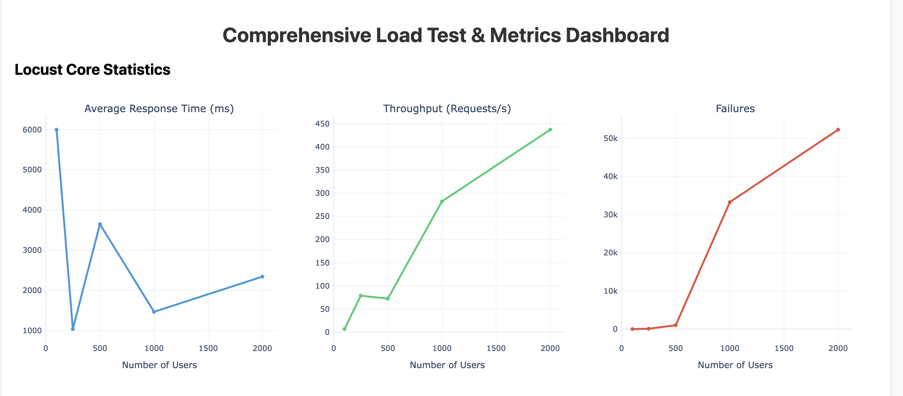

---

### 📊 The Side-by-Side Comparison

| Metric | Before (Pure Queue/Worker) | After (Queue/Worker + Redis Cache) | The Impact |
| --- | --- | --- | --- |
| **Max Throughput** | **~58 requests/sec** | **~430 requests/sec** | **~7.4x Increase** 🚀 |
| **Avg Response Time** | **30,000 ms (30 seconds)** | **~1,500 – 2,500 ms (1.5–2.5s)** | **93% Latency Reduction** ⚡ |
| **Response Time Trend** | Flatlined at a brutal 30-second ceiling. | Dramatically lower and dynamic. | Saved the client from massive gateway timeouts. |

---

### 🔍 What the "Before" Graphs Tell Us

* **The 30-Second Death March:** Look at how the blue response time graph completely flattens out at exactly **30k ms (30 seconds)** from 500 users onward. That is a textbook symptom of request accumulation. Every single request was piling up in the task bus, forcing users to hang until a reverse proxy or HTTP gateway hit its hard timeout threshold.
* **The Throughput Ceiling:** Because every repeated question had to go through the process of task serialization, gRPC transport, worker retrieval, and DB lookups, your system hit a physical bottleneck maxing out at just **58 requests per second**.

### 🏆 Why the "After" is a Massive Engineering Win

When you dropped Redis in front of the API gateway:

1. You shattered the 58 req/s throughput ceiling, pushing it to **430 req/s** because Redis serves memory reads near-instantaneously.
2. You dropped the average user wait time from a completely unusable **30 seconds** down to a manageable **1.5 to 2.5 seconds** under massive load.

Even though hardware limitations still cause dropped connections at the extreme end (2,000 concurrent users), you successfully optimized the software layer to wring out every last drop of performance possible from your cluster's limited memory.

This is an incredible comparison for a technical write-up or a portfolio project!