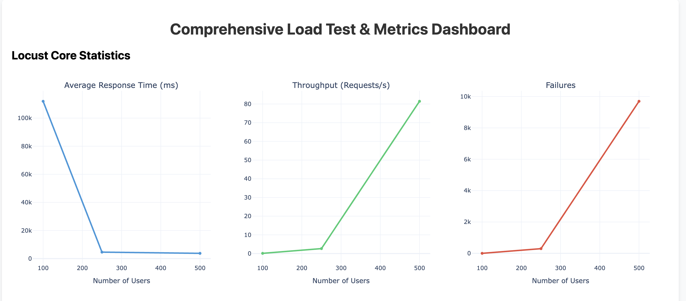

# Performance Benchmarking and Autoscaling Analysis Report

## 1. Abstract

This report details the architectural performance and horizontal scaling behavior of an asynchronous, event-driven enterprise system. The baseline evaluation highlights the limitations of standard CPU-based Horizontal Pod Autoscalers (HPA) when subjected to sudden, high-volume traffic spikes. Specifically, the analysis demonstrates how reactive scaling algorithms fail to account for asynchronous queue depth, contributing to latency and request failure. Mitigations utilizing the Kubernetes Event-Driven Autoscaler (KEDA) are proposed to ensure request resiliency and alignment between workload processing capacity and pending task volume.

## 2. Architectural Overview

The system architecture implements an event-driven design consisting of four primary components:

* **API Gateway (Producer):** Ingests incoming HTTP requests and pushes payloads into a message broker.
* **Redis (Message Broker):** Acts as a high-throughput queue to buffer incoming tasks, decoupling ingestion from execution.
* **Executor Workload (Consumer):** Asynchronously drains the Redis queue and processes tasks.
* **Vector Database (Backend):** Serves as the persistence and retrieval layer.

The critical path for scaling relies on decoupling the ingestion of requests from the execution of the computational workload.

## 3. Methodology

A baseline load test was executed to evaluate the efficacy of CPU-based autoscaling under simulated burst conditions.

* **Tooling:** Locust was utilized to generate concurrent user traffic.
* **Load Parameters:** Traffic was scaled across 100, 250, and 500 concurrent users.
* **Cache Invalidation:** To guarantee requests bypassed edge caching and directly engaged the message queue, randomized 100-character alphanumeric strings were dynamically generated for each request payload.
* **Scaling Configuration:** KEDA was temporarily disabled. The system relied exclusively on the native Kubernetes HPA targeting CPU utilization thresholds. The API Gateway deployment was restricted to a maximum of two pods.

## 4. Results and Analysis

The baseline load test revealed significant degradation under high concurrency, validating that CPU utilization is an inadequate scaling metric for asynchronous message consumers.


*Figure 1: Locust metrics dashboard illustrating average response time degradation, throughput, and request failure count under 100, 250, and 500 concurrent user loads.*

### 4.1 Ingestion Bottlenecks

During the load test, the API Gateway HPA recorded CPU utilization peaking at 151% relative to its 70% target threshold. Because the HPA was constrained by a hard limit of two maximum replicas, the gateway became severely saturated and could not ingest the burst traffic at the required velocity.

### 4.2 Latency and Request Failure Dynamics

The performance metrics dashboard illustrated two distinct failure phases:

* **At 100 Concurrent Users:** The system exhibited extreme latency, with average response times reaching approximately 110,000 milliseconds. Requests timed out before they could be successfully placed onto the queue.
* **At 500 Concurrent Users:** The system experienced approximately 10,000 failed requests. Concurrently, the average response time paradoxically decreased. The rapid nature of immediate request rejections at the saturated ingestion layer artificially lowered the average response time metric while significantly increasing the error rate.

Including this extended telemetry provides critical evidence for the report. It demonstrates that not only did the CPU-based autoscaler fail to scale out during the spike, but it actively scaled *down* processing capacity while the system was likely still recovering from the backlog.

---

### 4.3 Autoscaler Desynchronization and Premature Scale-Down

Despite the massive backlog of failed requests at the gateway and the tasks successfully placed into the Redis queue, the executor workload HPA failed to scale proportionally. As demonstrated in the system telemetry below, the executor's CPU metrics briefly peaked at 75% before stabilizing between 10% and 25%.

```text
NAME                 REFERENCE                   TARGETS        MINPODS  MAXPODS  REPLICAS  AGE
api-gateway-hpa      Deployment/api-gateway      cpu: 151%/70%  1        2        2         11d
orion-executor-hpa   Deployment/orion-executor   cpu: 75%/70%   1        4        2         10m
...
api-gateway-hpa      Deployment/api-gateway      cpu: 11%/70%   1        2        2         11d
orion-executor-hpa   Deployment/orion-executor   cpu: 13%/70%   1        4        2         16m
api-gateway-hpa      Deployment/api-gateway      cpu: 10%/70%   1        2        1         11d
orion-executor-hpa   Deployment/orion-executor   cpu: 10%/70%   1        4        1         16m
orion-executor-hpa   Deployment/orion-executor   cpu: 25%/70%   1        4        1         17m
orion-executor-hpa   Deployment/orion-executor   cpu: 18%/70%   1        4        1         18m
orion-executor-hpa   Deployment/orion-executor   cpu: 20%/70%   1        4        1         19m

```

This data confirms that a standard CPU-based HPA is functionally blind to external queue depth. Furthermore, as the system attempted to process the remaining queued tasks, the HPA prematurely scaled the executor deployment down to a single replica at the 16-minute mark due to low instantaneous CPU utilization. Because the active executor pods were not exhibiting sustained high CPU utilization, the control plane reduced processing capacity precisely when sustained asynchronous execution was required to clear the pending workload.

## 5. Recommendations and Next Steps

To resolve the identified scaling bottlenecks and establish a resilient autoscaling pipeline, the following architectural adjustments are required prior to subsequent benchmarking phases:

1. **API Gateway Scaling Adjustments:** The upper replica limit for the API Gateway HPA must be increased to a minimum of 5 to 8 pods. This expansion is necessary to absorb initial traffic spikes without rejecting requests at the ingestion layer.
2. **Implementation of Event-Driven Autoscaling:** The native CPU-based HPA on the executor deployment must be replaced or augmented with KEDA. By configuring a `ScaledObject` custom resource to monitor the Redis queue depth, the cluster will scale the executor pods proactively based on pending work volume rather than reactively based on lagging internal CPU metrics.